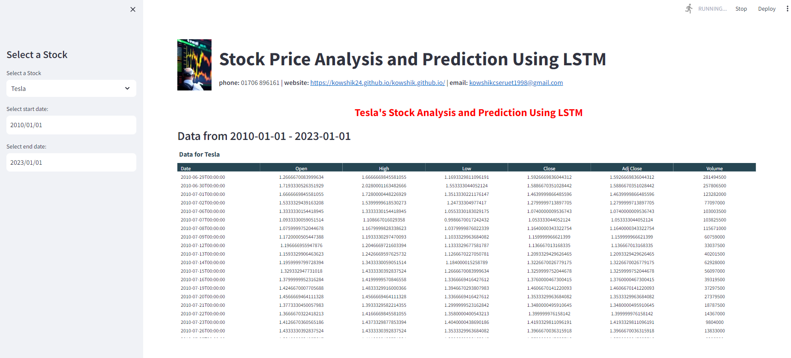
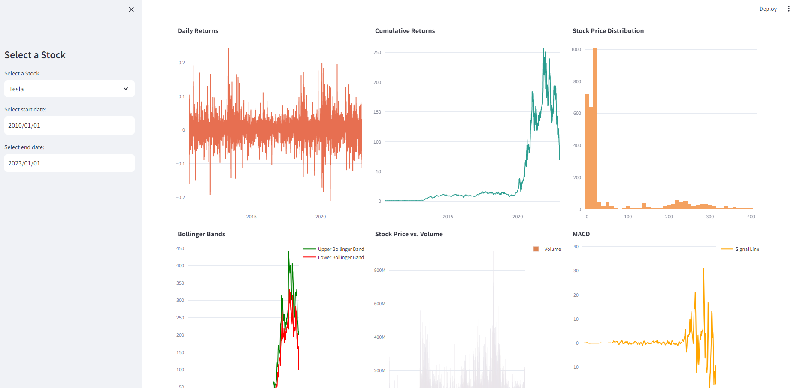
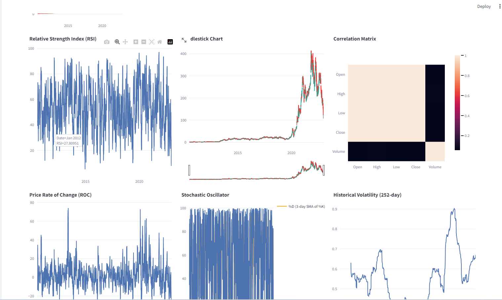
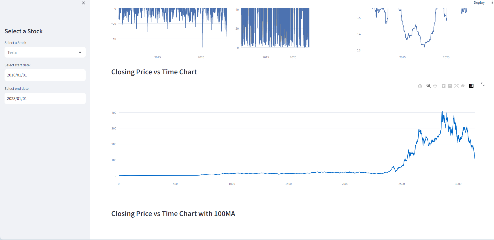
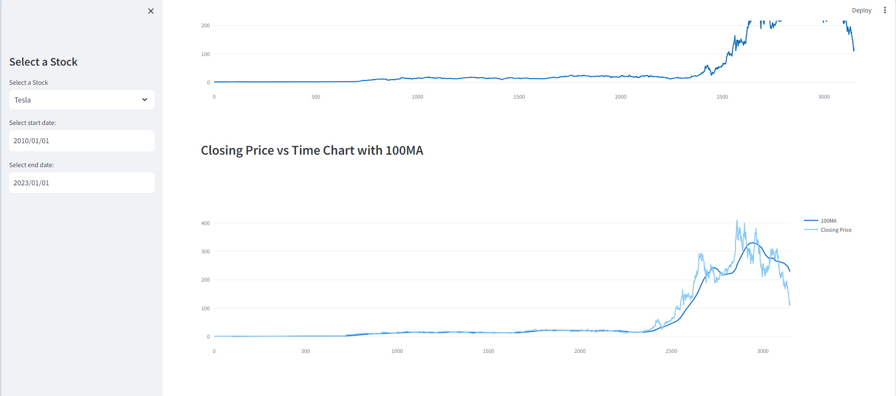
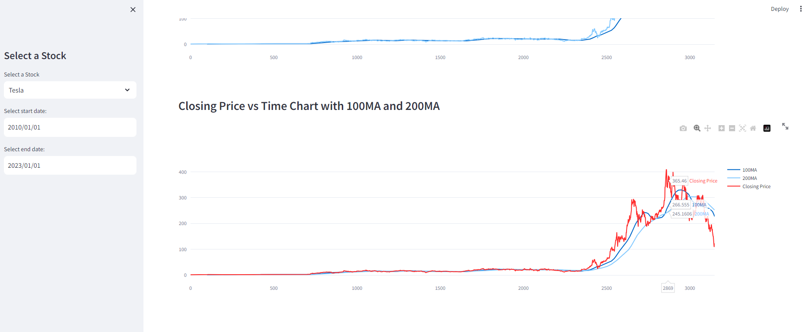
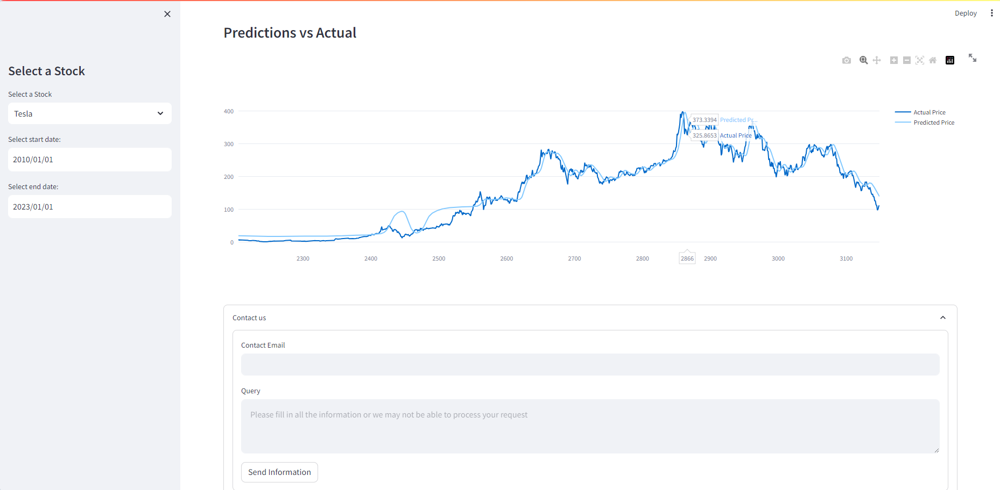

# 📈 Stock Price Analysis and Prediction Using LSTM 🚀


Dive deep into the world of stocks with our application! 🌍 Powered by LSTM (Long Short-Term Memory) networks, we provide a comprehensive analysis and prediction of stock prices. Leveraging libraries like pandas, numpy, matplotlib, yfinance, keras, streamlit, and plotly, we ensure accurate and visually appealing insights. 📊

## 🌟 Features

1. **🔍 Stock Selection**: Dive into a plethora of stock tickers for detailed analysis and future predictions.
2. **📅 Date Range**: Customize your analysis period with a flexible date range.
3. **📋 Data Overview**: A comprehensive table showcasing stock data at your fingertips.
4. **🎨 Visualizations**: Rich and interactive visualizations including stock price trends, trading volumes, moving averages, daily returns, cumulative returns, Bollinger Bands, MACD, RSI, and so much more!
5. **🔮 Predictions**: Peer into the future with our LSTM-powered stock price predictions.
6. **💌 Contact Form**: Got questions? We've got a built-in contact form waiting for you!

## 🖼️ Sample Visualizations 🎨
Dive into the visual essence of our application with these sample images. They provide a glimpse of the rich and interactive visualizations you can expect!

|  |  |
|:--------------------------------:|:--------------------------------:|
|     **Sample Visualization 1**   |     **Sample Visualization 2**   |
|  |  |
|     **Sample Visualization 3**   |     **Sample Visualization 4**   |
|  |  |
|     **Sample Visualization 5**   |     **Sample Visualization 6**   |
|  |  |
|     **Sample Visualization 7**   |     **Sample Visualization 8**   |

> 🌟 _Experience the vibrant and detailed insights our application offers. It's not just about numbers; it's about visual storytelling!_

## 🛠 Installation

1. **Clone the Magic**: 
```bash
git clone https://github.com/kowshik24/PredictStock
```
2. Step into the Portal🏃‍♂️ :
```bash
cd PredictStock
```
3. Craft Your Environment🔨:
```bash
python -m venv venv
```
4. Awaken the Environment 🐍:
```bash
venv\Scripts\activate
```
5. Install the required libraries 📚:
```bash
pip install -r requirements.txt
```
6. Launch the Rocket 🚀:
```bash
streamlit run app.py
```

## 📞 Contact

For any queries or feedback, please reach out to:

- 📧 **Email**: [kowshikcseruet1998@gmail.com](mailto:kowshikcseruet1998@gmail.com)
- 📱 **Phone**: 01706 896161
- 🌐 **Website**: [https://kowshik24.github.io/kowshik.github.io/](https://kowshik24.github.io/kowshik.github.io/)
- 🚀 **GitHub**: [GITHUB_LINK](https://github.com/kowshik24)

---

> 🌟 _We value your feedback and are always here to help. Let's connect!_ 🌟
